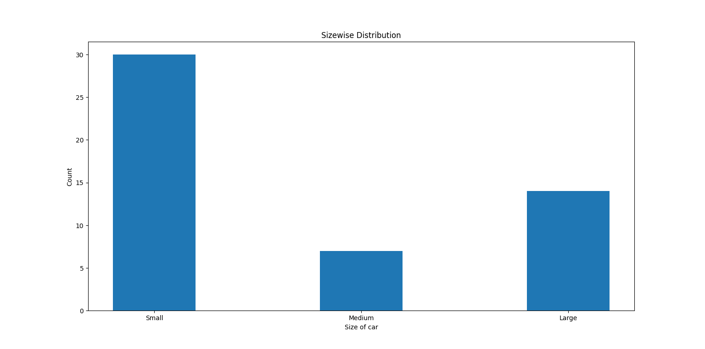

# ACLPR

- This Automatic Car and License Plate Recognizer (ACLPR) project is my extension of the repository [here](https://github.com/DoubangoTelecom/ultimateALPR-SDK).
- The extensions are: Display of car and number plate recognition with counter, two-lane vehicle counter (IN/OUT), faster processing optimization and video analytics of various parameters.
- All details about this video processing and analytics project implementation can be found [here](https://drive.google.com/file/d/1RGl8_tvvNc0AJ8pIfps6UNyp_uan5Gai/view?usp=sharing).

### Instructions:
- Place the files in the following folder: `ultimateALPR-SDK\samples\python\recognizer` and run as per the platform specific instructions in the original repo link below.
- Change the input/output locations set in the files as required.
- The `img_recognizer.py` file takes only one image as input. This script can be used for testing and debugging purposes and will save the processed image.
- The `vid_recognizer.py` file takes a video as input. This will save a video with the processed video.

### Outputs:

Output on an image input:

Sample of video output for video input:

<!-- Output for Indian number plate recognition:

 -->

One of the paramters analyzed - Sizewise distribution for Indian cars:

As expected, the size of small cars are more than others. But large cars being more than medium cars is interesting to note.

<!-- ### Notes: -->
<!-- - Videos for the same can be found [here](https://www.youtube.com/channel/UCOTbwn7ErrgyYGabhTwlXFw). -->
