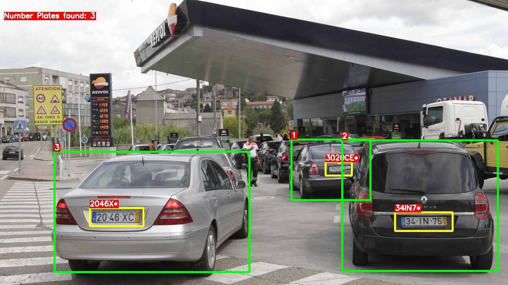
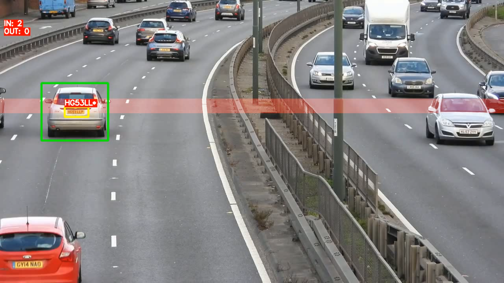
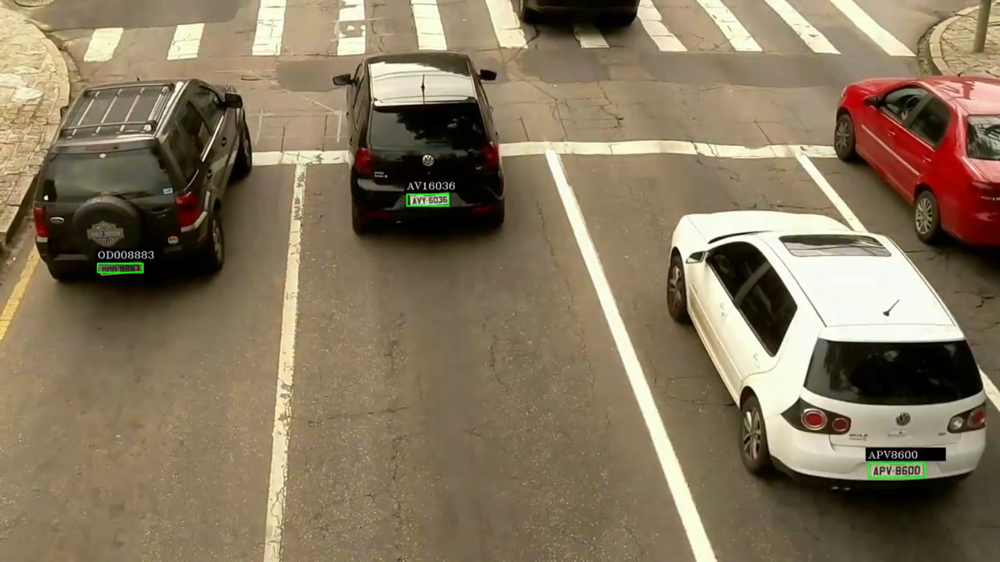

# ACLPR

### Instructions:
- Place the files in the following folder: `ultimateALPR-SDK\samples\python\recognizer` and run as per the platform specific instructions in the original repo link below.
- Change the input/output locations set in the files as required.
- The `img_recognizer.py` file takes only one image as input. This script can be used for testing and debugging purposes and will save the processed image.
- The `vid_recognizer.py` file takes a video as input. This will save a video with the processed video.

### Output:

Output on an image input:

Sample of video output for video input:

Output for Indian number plate recognition:

### Note:
- This is my extension of the repository [here](https://github.com/DoubangoTelecom/ultimateALPR-SDK).
- Details about this implementation can be found [here](https://drive.google.com/file/d/1RGl8_tvvNc0AJ8pIfps6UNyp_uan5Gai/view?usp=sharing).
- Videos for the same can be found [here](https://www.youtube.com/channel/UCOTbwn7ErrgyYGabhTwlXFw).
